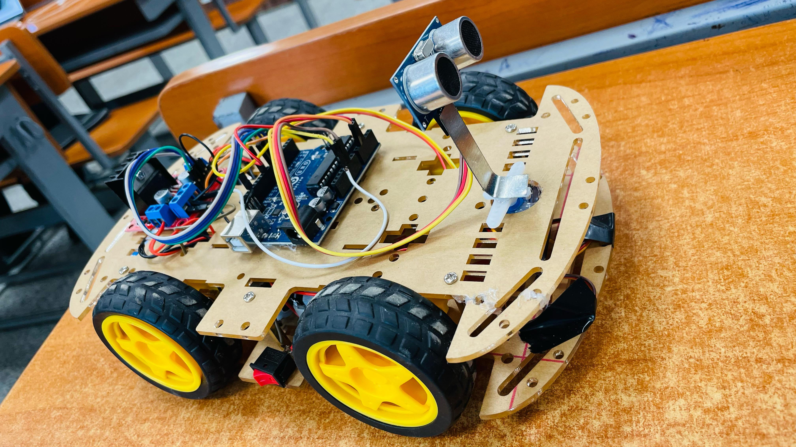
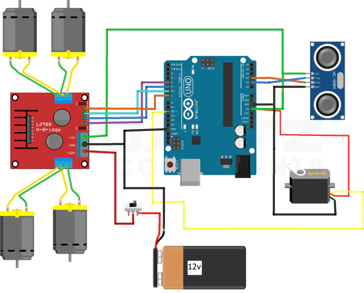

# Obstacle Detection and Avoidance Robot (2024)

This project involves the design and development of an **autonomous robot** capable of **detecting and avoiding obstacles** in real-time. The robot uses an **ultrasonic sensor** to detect obstacles and adjusts its path accordingly to avoid collisions.

## Technologies and Components Used:
- **Arduino Uno**
- **Ultrasonic Sensor (HC-SR04)**
- **Motor Driver (L298N)**
- **DC Motors**
- **Servo Motors**
- **C/C++ Programming**
  
## Project Description:
The robot is equipped with a **single ultrasonic sensor** to detect obstacles in front of it.

### Functionality:
- The robot moves forward as long as there are no obstacles detected.
- When an obstacle is detected in front (within 15 cm):
  - If the left side is clear, the robot turns left.
  - If the left side is blocked, the robot moves backward and then turns right to find an alternative path.
  
### Algorithm:
1. The robot continuously checks the distance using the ultrasonic sensor.
2. If no obstacle is detected in front, the robot moves forward.
3. If an obstacle is detected, the robot checks if the left side is clear:
   - If the left side is clear, it turns left.
   - If blocked, it moves backward and turns right.

## Completed Robot Design:
Below is an image of the completed **Obstacle Detection and Avoidance Robot**:

## Circuit Diagram:
Below is the circuit diagram for the Obstacle Detection and Avoidance Robot:

## Code:
The code is written in **C/C++** using the **Arduino IDE**. The program uses the **pulseIn()** function to read the distance from the ultrasonic sensor and control the motors based on the distance measurements.

### Key Functions:
- **moveForward()**: Moves the robot forward.
- **moveBackward()**: Moves the robot backward.
- **turnLeft()**: Turns the robot left.
- **turnRight()**: Turns the robot right.
- **stopMotors()**: Stops the motors.

## Installation:
### 1. Arduino IDE:
- Download and install the [Arduino IDE](https://www.arduino.cc/en/software).
  
### 2. Hardware:
- **Arduino Uno** 
- **HC-SR04 Ultrasonic Sensor** (for detecting obstacles)
- **Motor Driver** (L298N)
- **DC Motors**
  
### 3. Wiring:
- Connect the **HC-SR04** ultrasonic sensor to the designated pins on the Arduino.
- Connect the **DC motors** and **motor driver** to the appropriate pins.

## Usage:
1. Open the **Arduino IDE** and upload the code to the Arduino board.
2. Test the robot on different surfaces and watch it automatically avoid obstacles based on sensor input.

## Future Improvements:
- **Add additional sensors** (e.g., right ultrasonic sensor) for better obstacle detection and navigation.
- Implement **better pathfinding algorithms** for more complex environments.
- Add **Bluetooth or WiFi control** to manually override the robot’s path.
  
## Author:
- **Mohammad Anas**
  
For any inquiries or contributions, feel free to open an issue or pull request.

